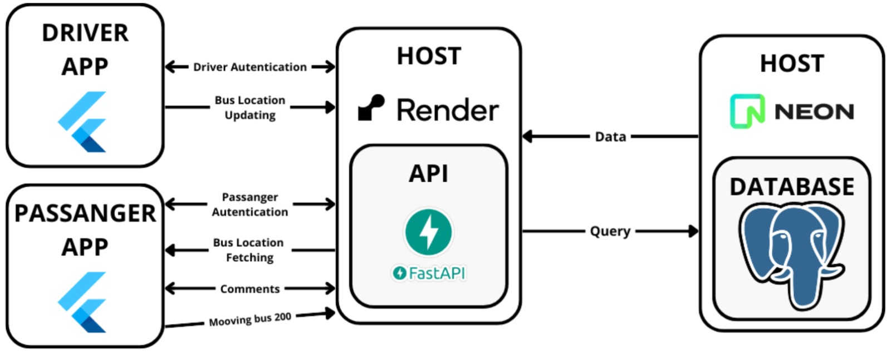

  

<h1 align="center">Gpbus mobile</h1>

Public transport tracking in real time!

## Contents
- [Description](#description)
- [Installing and running](#installing-and-running)
- [License](#license)
- [Contacts](#contacts)

## Description  
This two mobile apps objective is:
- Store the location of buses in a postgreSQL database.
- Show the location of buses in a mobile app in real time.
- Share comments about the buses.
The following image is a diagram that shows the interaction between the two mobile apps and the api (the api repository its:[api](https://github.com/newtonepv/gpbus_api))

  

## Installing and running  
Ceck the README.md inside each app directory to know how to install both.

## License
This project is open for educational and practicing purposes.  
The commercial usage is initially forbidden, [contact me](#contacts) to discuss terms.

## Contacts
- LinkedIn: [linkedin.com/in/newtonepv](https://linkedin.com/in/newtonepv)
- Email: [newtonepv@gmail.com](mailto:newtonepv@gmail.com)
