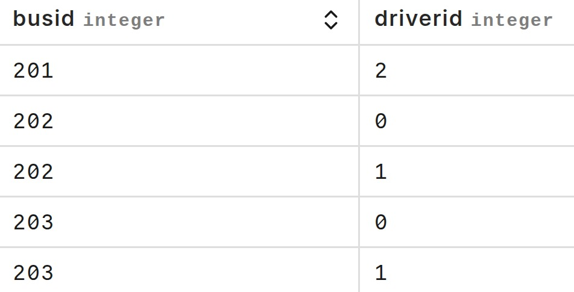

# GPBus for drivers

## Description
This is an app made with the objective of: 
- Updating public buses locations in real time.

<hr>

## Contents
- [How to drive a bus](#how-to-drive-a-bus).
- [Features](#features)
- [Pending Features](#pending-features)
- [Installing & Running](#installing-and-running)

<hr>

## How to drive a bus
The only driver account available for all users id is <b>2</b>, which means that the only drivable bus is the bus <b>nº201</b>.<br> The password for this account is <b>"3427yr"</b>.
<hr>

## Features
### Login page
- Driver authentication.
### Home page
- Bus selection.
- Real-time bus position updates (its updated to the position of the device running the app).
- Bus and driver assignments
### Database level
Buses and drivers have a many-to-many relationship, because each driver is assigned to drive a group of buses and each bus is assigned to be driven by a group of drivers, here is an image of the busassigment relational table.

<p align="center" style="margin: 0; padding: 0;">
  
</p>

<hr>

## Pending features
- Language selection (only brazilian portuguese for now).
- Running on mobile emulator.

<hr>

## Installation and running
### Pre-requisites
(Do not require android studio).
- Flutter & Dart (SDK) version higher than 3.0.0
- Chrome browser.
### Installation Steps
- Clone the repository:
  ```bash
  git clone https://github.com/newtonepv/gpbus_mobile.git
  cd gpbus_mobile
  ```
- Install dependencies:
  ```bash
  cd driver_app
  flutter pub get
  ```
### Running steps
- Run the app on chrome:
  ```bash
  flutter run -d chrome
  ```
